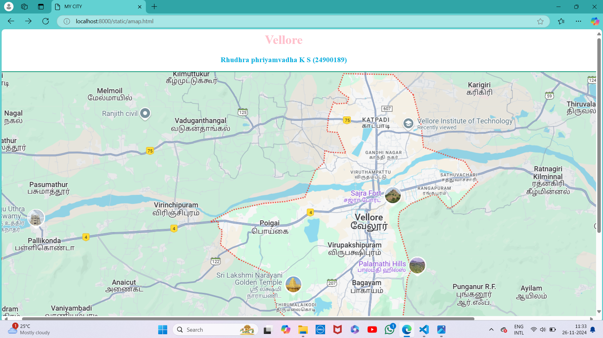
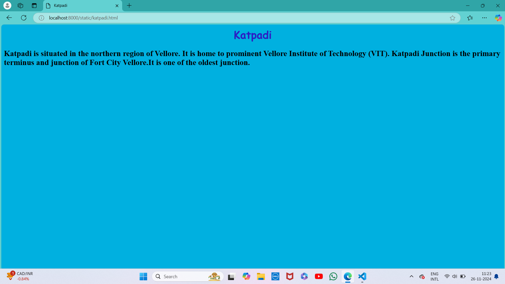
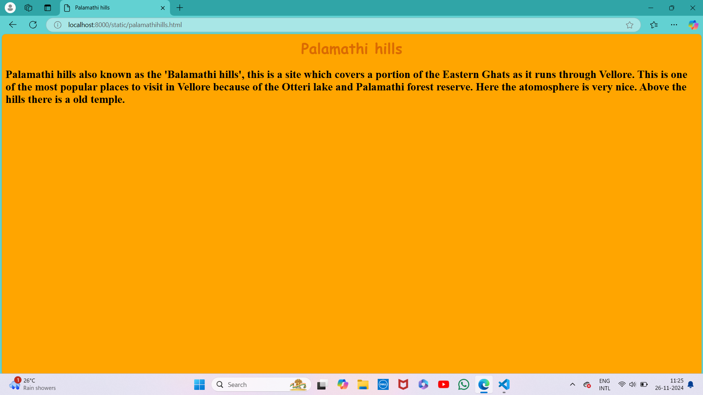
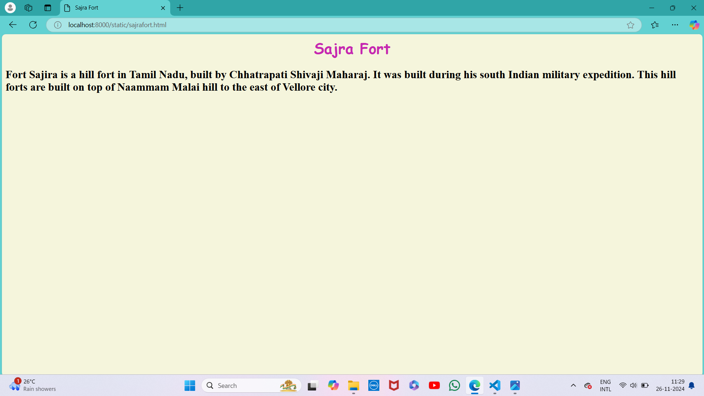
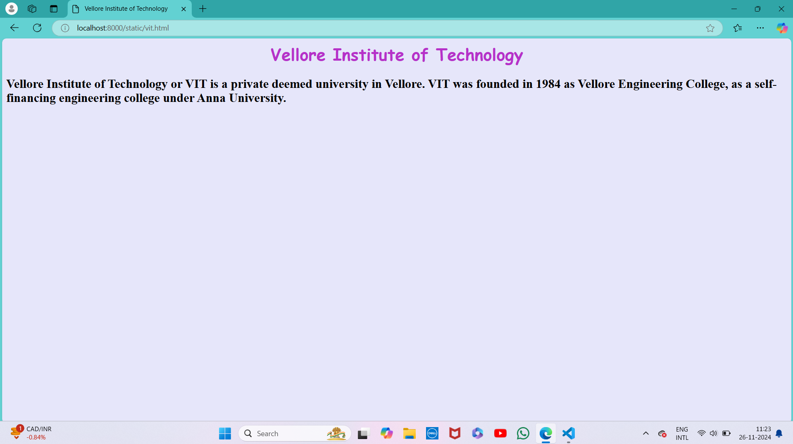

# Ex04 Places Around Me
## Date:26.11.2024 

## AIM
To develop a website to display details about the places around my house.

## DESIGN STEPS

### STEP 1
Create a Django admin interface.

### STEP 2
Download your city map from Google.

### STEP 3
Using ```<map>``` tag name the map.

### STEP 4
Create clickable regions in the image using ```<area>``` tag.

### STEP 5
Write HTML programs for all the regions identified.

### STEP 6
Execute the programs and publish them.

## CODE
```
amap.html
 
<html>
    <head>
        <title>MY CITY</title>
    </head>
    <body>
        <h1 align="center">
            <font color="pink"><b>Vellore</b></font>
        </h1>
        <h3 align="center">
            <font color="sky blue"><b>Rhudhra phriyamvadha K S (24900189)</b></font>
        </h3>
        <center>
            

            <map name="image-map">
                <area  alt="sajra fort" title="sajra fort" href="sajrafort.html" coords="974,314,72" shape="circle">
                <area  alt="palamthi hills" title="palamthi hills" href="palamathihills.html" coords="1016,501,74" shape="circle">
                <area  alt="sri lakshmi narayani golden temple" title="sri lakshmi narayani golden temple" href="goldentemple.html" coords="683,537,101" shape="circle">
                <area  alt="vellore institute of technology" title="vellore institute of technology" href="vit.html" coords="1178,126,113" shape="circle">
                <area  alt="katpadi" title="katpadi" href="katpadi.html" coords="986,127,39" shape="circle">
            </map>
</map>
</center>
</body>
</html>
```
```
goldentemple.html

<html lang="en"> 
<head>
    <meta charset="UTF-8">
    <meta name="viewport" content="width=device-width, initial-scale=1.0">
    <title>Sri lakshmi narayani Golden temple</title>

</head>
<body bgcolor="pink">
    <h1 align="center" style="font-family: cursive; color: rgb(189, 3, 152);">Sri lakshmi narayani Golden temple</h1>
    <h2 style="font-family: serif;"> Sripuram is the abode of the Goddess Lakshmi, the Goddess of Prosperity. The temple was built with pure
         gold (1500 kg) and has intricate work done by artisans specialising in temple art using gold.
</h2>    
</body>
</html>
```
```
katpadi.html

<html lang="en"> 
<head>
    <meta charset="UTF-8">
    <meta name="viewport" content="width=device-width, initial-scale=1.0">
    <title>Katpadi</title>

</head>
<body bgcolor="sky blue">
    <h1 align="center" style="font-family: cursive; color: rgba(53, 3, 189, 0.856);">Katpadi</h1>
    <h2 style="font-family: serif;"> Katpadi is situated in the northern region of Vellore. It is home to prominent
         Vellore Institute of Technology (VIT). Katpadi Junction is the primary terminus and junction of Fort City Vellore.It is one of the 
         oldest junction.
    </h2>
    
</body>
</html>
```
```
palamathihills.html

<html lang="en"> 
<head>
    <meta charset="UTF-8">
    <meta name="viewport" content="width=device-width, initial-scale=1.0">
    <title>Palamathi hills</title>

</head>
<body bgcolor="orange">
    <h1 align="center" style="font-family: cursive; color: rgba(189, 59, 3, 0.549);">Palamathi hills</h1>
    <h2 style="font-family: serif;"> Palamathi hills also known as the 'Balamathi hills', this is a site which covers a portion of the 
        Eastern Ghats as it runs through Vellore. This is one of the most popular places to visit in Vellore because of the Otteri lake 
        and Palamathi forest reserve. Here the atomosphere is very nice. Above the hills there is a old temple.

</h2>    
</body>
</html>
```
```
sajrafort.html

<html lang="en"> 
<head>
    <meta charset="UTF-8">
    <meta name="viewport" content="width=device-width, initial-scale=1.0">

    <title>Sajra Fort</title>

</head>
<body bgcolor="beige">
    <h1 align="center" style="font-family: cursive; color: rgba(189, 3, 170, 0.856);">Sajra Fort</h1>
    <h2 style="font-family: serif;"> Fort Sajira is a hill fort in Tamil Nadu, built by Chhatrapati Shivaji Maharaj. 
        It was built during his south Indian military expedition. This hill forts are built on top of Naammam Malai hill to the east of Vellore city.
    </h2>
    
</body>
</html>
```
```
vit.html

<html lang="en"> 
<head>
    <meta charset="UTF-8">
    <meta name="viewport" content="width=device-width, initial-scale=1.0">
    <title>Vellore Institute of Technology</title>

</head>
<body bgcolor="lavender">
    <h1 align="center" style="font-family: cursive; color: rgba(170, 3, 189, 0.796);">Vellore Institute of Technology</h1>
    <h2 style="font-family: serif;"> Vellore Institute of Technology or VIT is a private deemed university in Vellore.
        VIT was founded in 1984 as Vellore Engineering College, as a self-financing engineering college under Anna University.
</h2>    
</body>
</html>
```
## OUTPUT







## RESULT
The program for implementing image maps using HTML is executed successfully.
